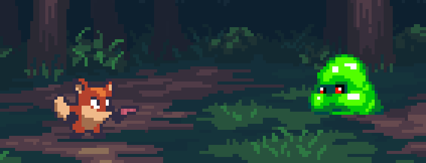

# Fox Forest Runner

*Read this in [简体中文](README.zh.md)*

A simple 2D shooter game created with Godot 4, where you control a fox character shooting at approaching slime enemies.

## 🎮 Game Features

- Fast-paced 2D action gameplay
- Pixel art graphics with fluid animations
- Progressive difficulty (enemies spawn faster over time)
- Sound effects and background music

## 🎯 How to Play

- **W** - Move up
- **A** - Move left
- **S** - Move down
- **D** - Move right
- Stand still to automatically shoot bullets
- Avoid green slimes, destroy them by shooting
- Game ends when you collide with an enemy

## 🛠️ Built With

- [Godot Engine 4](https://godotengine.org/)
- Pixel art sprites
- Custom sound effects

## 📷 Screenshots

The game features pixel art style graphics with animated characters in a forest environment.

## 🔧 Installation

### Windows
1. Download the game from the `Builds/Windows/` folder
2. Run the executable file `MyFirstGame.exe`

### macOS
1. Download the game from the `Builds/Mac/` folder
2. Mount the DMG file and drag the app to your Applications folder
3. Run the application

## 📝 Learning Project

This is my first game created while learning Godot game development following a tutorial series on Bilibili:
[Godot Tutorial Series](https://www.bilibili.com/video/BV1fuCrYFEoG/)

## 🚀 Version

- Version 1.0.0 (Initial Release)

## 👨‍💻 Author

- **haipro** - [haipromail@163.com](mailto:haipromail@163.com)

## 📄 License

This project is available for personal use and learning purposes. 