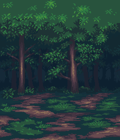

# 狐狸森林跑者

这是一款使用Godot 4制作的简单2D射击游戏，玩家控制一只狐狸角色，射击接近的史莱姆敌人。

## 🎮 游戏特点

- 快节奏的2D动作游戏玩法
- 像素艺术风格的流畅动画
- 渐进式难度（敌人生成速度随时间加快）
- 音效和背景音乐

## 🎯 操作方法

- **W** - 向上移动
- **A** - 向左移动
- **S** - 向下移动
- **D** - 向右移动
- 站立不动时自动射击
- 避开绿色史莱姆，通过射击消灭它们
- 当玩家与敌人碰撞时游戏结束

## 🛠️ 开发工具

- [Godot引擎4](https://godotengine.org/)
- 像素艺术精灵
- 自定义音效

## 📷 游戏截图

游戏采用像素艺术风格，在森林环境中呈现动画角色。

## 🔧 安装方法

### Windows系统
1. 从`Builds/Windows/`文件夹下载游戏
2. 运行可执行文件`MyFirstGame.exe`

### macOS系统
1. 从`Builds/Mac/`文件夹下载游戏
2. 挂载DMG文件并将应用拖到应用程序文件夹
3. 运行应用程序

## 📝 学习项目

这是我在学习Godot游戏开发时创建的第一个游戏，跟随B站上的教程系列学习：
[Godot教程系列](https://www.bilibili.com/video/BV1fuCrYFEoG/)

## 🚀 版本信息

- 版本1.0.0（初始发布）

## 👨‍💻 作者

- **haipro** - [haipromail@163.com](mailto:haipromail@163.com)

## 📄 许可证

本项目可用于个人使用和学习目的。

---

*其他语言版本: [English](README.md), [简体中文](README.zh.md)* 